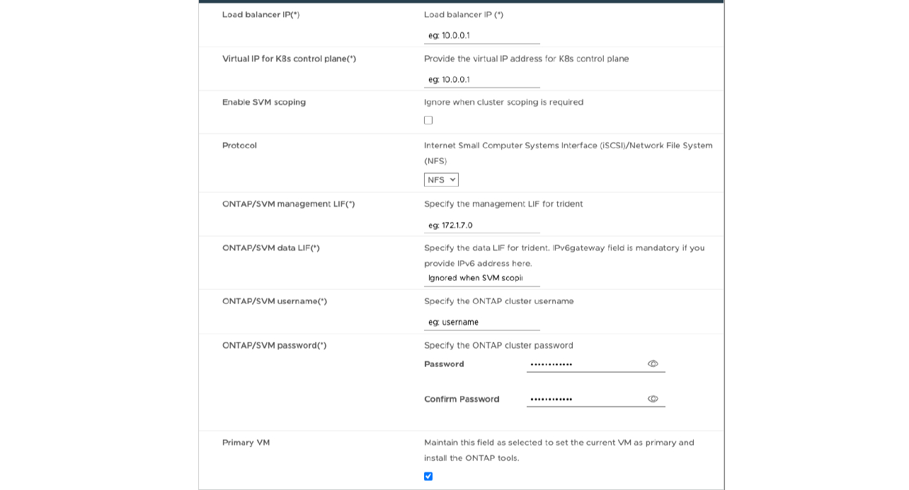

= Deploy HA configuration
:icons: font
:imagesdir: ../media/

[.lead]

You can configure HA three nodes in either small, medium, or large configurations. HA deployment uses Trident to store the services data.

* Small HA three nodes contain 8 CPUs and 16 GB RAM per node.
* Medium HA three nodes contain 12 CPUs and 24 GB RAM per node.
* Large HA three nodes contain 16 CPUs and 32 GB RAM per node.

*Before you begin*

This task gives you instructions on how to install HA three nodes in small, medium, or high configurations.
[NOTE]
Creating the content library is a mandatory step for deploying HA three nodes configuration. See link:../deploy/download-ontap-tools.html[Download ONTAP tools] for details. Learn more https://blogs.vmware.com/vsphere/2020/01/creating-and-using-content-library.html[Creating and Using Content Library].

Make sure you have imported your OVA into your content library. Keep the name of the content library and the library item name that you have given to your OVA item handy.

[NOTE]
Before proceeding with the deployment, set the cluster's Distributed Resource Scheduler (DRS) on the inventory to 'Conservative' during the installation of ONTAP tools. This ensures that VM's do not migrate during the installation.

*Steps*

. To deploy from vSphere server:
.. Log in to the vSphere server.
.. Navigate to the resource pool or the host where you want to deploy the OVA and right-click the required location where you want to deploy the VM, and select *Deploy OVF template...*
[NOTE]
Do not deploy ONTAP tools VMware vSphere virtual machine on a vVols datastore that it manages.

.. You can either enter the URL for the _.ova_ file or browse to the folder where the _.ova_ file is saved, and then select *Next*
. To deploy from content library:
.. Go to your content library and click on the library item that you want to deploy. 
.. Click on *Actions* > *New VM from This Template* 
. Select a name and folder for the virtual machine and select *Next*.
. Select the host and select *Next*
. Review the summary of the template and select *Next*.
. Read and accept the license agreement and select *Next*.
. In the *Configuration window*, select *High-Availability Deployment(S)*, *High-Availability Deployment(M)*, or *High-Availability Deployment(L)* configuration, depending on your requirement.
. Select the storage for the configuration and disk files, select *Next*.
. Select the destination network for each source network, select *Next*.
. Select *Customize template* > *system configuration* window. 
+
image:../media/ha-deployment-sys-config.png[system configuration]
+
Enter the following details:

.. Application username and password: This username and password is used for registering both VASA provider and SRA in the vCenter Server.
.. The *Enable AutoSupport* checkbox is selected by default. AutoSupport can be enabled or disabled only during deployment.
.. In the *ASUP Proxy URL* field, provide this URL to avoid firewall blockage for AutoSupport data transmission. 
.. Administrator username and administrator password: This is the password used to log in to ONTAP tools Manager. 
.. Enter your NTP server information in the *NTP Servers* field. 
.. Maintenance user password: This is used to grant access to ‘Maint Console Options’.
. In *Customize template* > *Deployment Configuration* window, enter the following details:
+

.. Enter an available IP address in the Virtual IP address for the Kubernetes control plane. You need this for the Kubernetes API Server.
.. In the advanced deployment option, select *Enable SVM scoping* option when you intend to use the directly added SVM user account. To use ONTAP cluster, do not select the checkbox.
+
[NOTE]
When SVM scope is enabled you should have already enabled SVM support with management IP address.
.. Select either NFS or iSCSI in the *Protocol* field. 
.. Enter the ONTAP Cluster or the SVM Management IP address in the *ONTAP/SVM Management LIF* field.
.. Enter the ONTAP Cluster or the SVM ONTAP/SVM Data LIF. The data LIF should belong to the protocol selected. For example, if iSCSI protocol selected, then an iSCSI data LIF should be provided.
.. For Storage VM, you can choose to provide your ONTAP’s default storage VM details or create a new storage VM. Do not enter the value in *Storage VM* field when Enable SVM scoping is selected as this field is ignored.
.. Enter the ONTAP/SVM username. ONTAP/SVM username and Password is required for Trident to create volumes for storing the data of services in case of advanced or HA deployment and to recover the data from volumes during node failure.
.. Enter the ONTAP/SVM Password.
.. Primary VM is enabled by default. Do not alter this choice.
. In *Customize template* > *Content Library Details* window, enter the *Content Library Name* and the *OVF Template Name*.
. In *Customize template* > *vCenter Configuration* window, provide the details of the vCenter Server where the content library is hosted.
. In *Customize template* > *Node Configuration* window, enter the network properties of the OVA for all the three nodes. 
+
[NOTE]
The information provided here will be validated for proper patterns during installation process. In the case of discrepancy, an error message will be displayed on the web console and you will be prompted to correct any incorrect information provided.
+
.. Enter the host name. Host names that consist of uppercase letters (A-Z), lowercase letters (a-z), digits (0-9), and the hyphen (-) special character only are supported. If you want to configure dual stack, specify the host name mapped to IPv6 address. 
.. Enter IP address (IPV4) mapped to the host name. In case of dual stack, provide any available IPv4 IP address that is in the same VLAN as the IPv6 address.
.. Enter the IPV6 address on the deployed network only when you need dual stack.
.. Specify the prefix length only for IPV6. 
.. Specify the subnet to use on the deployed network in Netmask (only for IPV4) field. 
.. Specify the Gateway on the deployed network.
.. Specify the Primary DNS server IP address.
.. Specify the Secondary DNS server IP address.
.. Specify the Search Domain name to use when resolving the hostname.
.. Specify the IPV6 gateway on the deployed network only when you need dual stack. 
. In *Customize template* > *Node 2 Configuration* and *Node 3 Configuration* window, enter the following details:
.. Host name 2 and 3 - Host names that consist of uppercase letters (A-Z), lowercase letters (a-z), digits (0-9), and the hyphen (-) special character only are supported. If you want to configure dual stack, specify the host name mapped to IPv6 address.
.. IP address
.. IPV6 address
. Review the details in the *Ready to complete* window, select *Finish*.
+
As the deployment task gets created, the progress is shown in the vSphere task bar.
. Power on the VM after the completion of the task.
+
The installation begins. You can track the installation progress in VM’s web console.
As part of the installation, node configurations are validated. The inputs provided under different sections under the Customize template in the OVF form are validated. In the case of any discrepancies, a dialog prompts you to take corrective action.
. Make necessary changes in the dialog prompt. Use tab button to navigate across the panel to enter your values, *OK* or *Cancel*.
. On selecting *OK*, the values provided would again be validated. ONTAP Tools for VMware allows you three attempts to correct any invalid values. If you are unable  to correct issues after three attempts, the product installation stops and you are advised to try the installation on a fresh VM. 
. After successful installation, the web console shows the state of ONTAP tools for VMware vSphere.